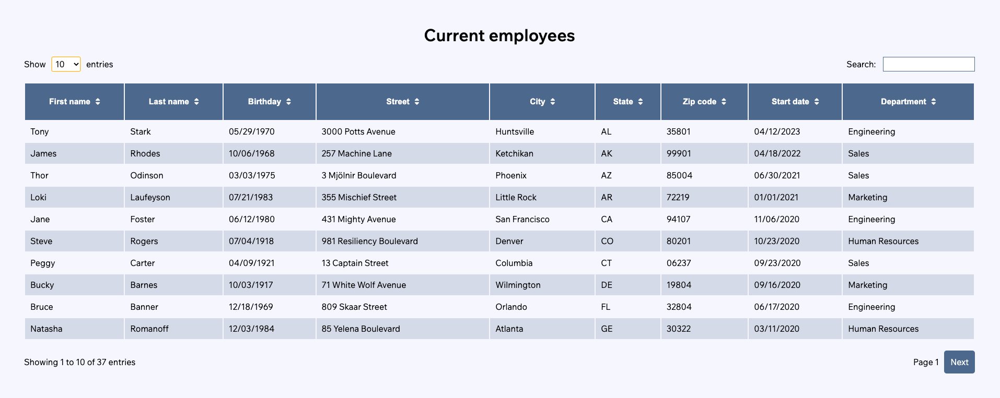

## Presentation
This is a revamp of an HR app called HRNet. The original version was made using jQuery, and this new version uses React!
This is project #14 of my OpenClassrooms front-end development course! I had to pick one of four features to code from scratch and make into an npm package – I chose the table, which you can find and download for yourself [here](https://www.npmjs.com/package/@chloeadriancreates/custom-react-table). I used Material UI for the others, which are all in the new employee form.

## Prerequisites
- [NodeJS (version 16.17.0)](https://nodejs.org/en/)
- [NPM (version 9.4.0)](https://www.npmjs.com/)

## Getting started
- Run `$ npm install` to install all dependencies
- Run `$ npm start` to see the 

## Thanks for reading, and happy coding!  
Chloé Adrian